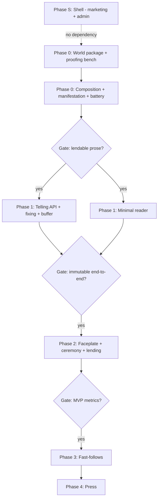

# Unica Press — Phased Workplan

**Status:** Working draft  
**Date:** June 2026  
**Parent:** [prd-unicapress.md](./prd-unicapress.md) · [V1-world-content-model.md](./V1-world-content-model.md)

This plan sequences build work across five phases. Phases are **gates**, not calendar commitments — each phase exits only when its gate criteria are met. Workstreams can overlap within a phase where dependencies allow.

**Two systems:** This workplan's Phases 0–4 describe **the App** (worldbuilding tool + Telling engine + reader — React/Node-or-Python/Postgres). **The Shell** (marketing site + staff admin — PHP/mysqli, this repo) is a separate system with its own phase, **Phase S**, sequenced first and built independently. See [scope-marketing-shell.md](./scope-marketing-shell.md) for its full scope and workplan.

---

## Workstreams

| Stream | Owns | Primary owner phase |
|---|---|---|
| **S — Shell** | Marketing site, staff admin/ops console (separate codebase/stack) | Phase S |
| **W — World content** | Entity schema, sourcebook port, packet compilation, publish pipeline | Phase 0 |
| **E — Engine** | Composition, manifestation, battery, fixing, Telling API, telemetry | Phase 0–1 |
| **F — Author tooling** | World package editor, skeleton authoring, proofing bench | Phase 0–1 |
| **X — Experience** | Retrieval faceplate, manuscript reader, patron shelf, lending | Phase 1–2 |

NOTE The worldbuilder tools should be published under worldbuilder.unicapress.com

The Experience stream consumes the Engine exclusively through the Telling API (PRD §9). The Engine consumes the World Package read-only at generation time. The Shell consumes nothing from the App except an optional public version string (see scope-marketing-shell.md §4).

---

## Phase S — The Shell (marketing + ops)

**Goal:** Public marketing presence and a working staff admin console, on the existing PHP/mysqli scaffold.

**Gate:** Admin login works; content/email libraries are CRUD-able; the contact form lands in the staff inbox; the marketing home page (with colophon stub) is live.

Runs **first and independently** of Phases 0–4 — no dependency on World/Engine work. Full breakdown in [scope-marketing-shell.md](./scope-marketing-shell.md) §8 (S0–S6).

---

## Phase 0 — Proof of prose

**Goal:** Validate that the generation pipeline can produce lendable short fiction — no consumer UI.

**Gate:** Twenty internally generated tellings read cold by the author. *Would you lend one to a stranger?* If no, do not proceed to Phase 1.

### W — World content

| # | Deliverable | PRD refs |
|---|---|---|
| W0.1 | Entity schema implemented (Locations, Characters, Objects, Themes, Organizations, Events, Attributes, Relationships) | §6, [world-content-model-v1.md](./world-content-model-v1.md) |
| W0.2 | Sourcebook port: 4 gazetteer cities + supporting canon for canon checks | A1.13 |
| W0.3 | Invariants, naming grammar, style fingerprint as publishable artifacts | A1.1, A1.3, A1.5 |
| W0.4 | Location packet compiler (≤ 2k tokens); publish produces versioned package snapshot | A1.2, A1.7, A1.12 |
| W0.5 | `*_meta` auto-generation on save; overwrite-on-regen v1 behavior | A1.9, F1.6 |
| W0.6 | `excluded` compartmentalization manifest for sensitive sourcebook material | A1.8 |

### F — Author tooling (minimum)

| # | Deliverable | PRD refs |
|---|---|---|
| F0.1 | Entity CRUD — sufficient to port sourcebook, not polished | F1.1 |
| F0.2 | Skeleton + storybeat authoring in Markdown/YAML | A2.4, F1.2 |
| F0.3 | **Proofing bench** — run full telling without fix/accession; show battery verdicts | F1.3 |
| F0.4 | Publish button → immutable `world_package_version` | A1.12 |

### E — Engine (pipeline)

| # | Deliverable | PRD refs |
|---|---|---|
| E0.1 | Composition service — seed, skeleton select, spine + cast + ending | A3.1, A3.5 |
| E0.2 | Manifestation service — scene prose against spine beat | A4.1 |
| E0.3 | Context assembly — invariants + location packet + spine + continuity ledger v1 | A4.3 |
| E0.4 | Continuity ledger extraction pass after each scene | A4.4 |
| E0.5 | Editorial battery — canon (HoleFinder), continuity, naming, style, safety | A5.1–A5.6 |
| E0.6 | Provider abstraction for generation calls | A4.5 |

### E — Content (author-authored)

| # | Deliverable | PRD refs |
|---|---|---|
| C0.1 | **3 skeletons** spanning ≥ 2 registers (proof set) | A2.2 (partial) |
| C0.2 | **3 registers** defined | A1.4 |
| C0.3 | Twenty proofing-bench tellings generated and read | — |

### Explicitly not in Phase 0

- Telling API / HTTP surface
- Fixing / accession / immutability
- Buffer-of-2 pacing
- SSE telemetry
- Any consumer UI
- Plates
- Entity packets beyond locations (A1.10) unless proofing shows need

---

## Phase 1 — The seam

**Goal:** End-to-end telling lifecycle through the API — compose, buffer, manifest, fix, re-read — with a minimal typographic reader. No theater.

**Gate:** A telling can be requested via API, scenes buffer ahead of the reader, fixed scenes are immutable on disk, and a minimal reader can complete a full telling without the faceplate.

### E — Engine

| # | Deliverable | PRD refs |
|---|---|---|
| E1.1 | **Telling API** — POST tellings, GET scenes, POST fix, GET shelf, SSE progress | §9, A8.1 |
| E1.2 | Buffer of 2 — scenes N+1 and N+2 ahead of reader | A4.2 |
| E1.3 | Fixing + accession record (provenance object) | A6.1, A6.2 |
| E1.4 | Uncut pages — resume abandoned telling | A6.3 |
| E1.5 | Stack coordinates + accession number at composition | A3.3 |
| E1.6 | Composition p90 ≤ 25s | A3.2 |
| E1.7 | Battery verdict logging for author review | A5.7 |

### X — Experience (minimal)

| # | Deliverable | PRD refs |
|---|---|---|
| X1.1 | **Minimal manuscript reader** — typographic, scene-at-a-time, no brass | C1.1, C1.2 |
| X1.2 | Fix signal on scene completion (no ritual animation yet) | C2.1 (partial) |
| X1.3 | Colophon with honesty text + package version | C2.4 (text only) |
| X1.4 | Re-read fixed telling from shelf | C3.2 |
| X1.5 | Anonymous patron token + shelf persistence | D1.1, D2.1 |
| X1.6 | CLI or bare-bones request form (city + register) — not faceplate | — |

### F — Author tooling

| # | Deliverable | PRD refs |
|---|---|---|
| F1.1 | Expand to **8 skeletons** spanning ≥ 3 registers | A2.2 |
| F1.2 | Skeleton lint + compatibility-tag coverage report | F1.2 |
| F1.3 | Changelog on entity save and publish | F1.8 |
| F1.4 | Gazetteer card attach for 4 cities | F1.7, B1.1 |

### W — World content

| # | Deliverable | PRD refs |
|---|---|---|
| W1.1 | Canon ledger structured queries for HoleFinder | A1.6, A1.11 |
| W1.2 | Relationships populated for sourcebook facts used in battery | A5.1 |

### Explicitly not in Phase 1

- Retrieval theater / faceplate
- Fixing ritual animation + stamp sound
- Lending
- Patron email signup prompt
- Plates
- Anti-repetition (A3.4)

---

## Phase 2 — The Archive (MVP launch)

**Goal:** Ship the full Steamlands experience per PRD §14 MVP cut.

**Gate:** MVP success test — ≥ 50% cold visitors who punch a slip finish; ≥ 25% of finishers lend or start a second telling.

### X — Experience (faceplate + ceremony)

| # | Deliverable | PRD refs |
|---|---|---|
| X2.1 | **Retrieval Engine faceplate** — gazetteer bay, register bank, prepared-for line | B1.1–B1.5 |
| X2.2 | Split-flap board + stack dial driven by SSE | B2.1, B2.2 |
| X2.3 | Arrival choreography + delivery cage + carrel shelf | B2.3, B2.4 |
| X2.4 | Audio system + silence bell | B2.5 |
| X2.5 | Fascia component library + type system | B3.1–B3.3 |
| X2.6 | Cage-to-book transition | C1.1 |
| X2.7 | **Fixing ritual** — letterpress deepen + date stamp + sound | C2.1 |
| X2.8 | Completion rite — blind-emboss colophon | C2.4 |
| X2.9 | Accessibility — keyboard, reduced motion, screen reader | B2.8 |
| X2.10 | First-visit ≤ 4 min to scene 1 | B2.7 |
| X2.11 | Request card as page zero | C2.2 |
| X2.12 | Patron card prompt after scene 2 | D1.2 |

### X — Lending & disclosure

| # | Deliverable | PRD refs |
|---|---|---|
| X2.13 | Lending slip + lent view + footer CTA | E1.1–E1.3 |
| X2.14 | "About the Engine" colophon page | E2.1 |

### E — Engine (polish)

| # | Deliverable | PRD refs |
|---|---|---|
| E2.1 | Slip composition persisted as request card data | B1.4 |
| E2.2 | Per-scene model metadata in accession record | A6.2, A4.5 |

### F — Author tooling

| # | Deliverable | PRD refs |
|---|---|---|
| F2.1 | World package editor — usable for ongoing edits post-launch | F1.1 |

### Launch content checklist

- [ ] 4 cities live in gazetteer (Slatewater, Skywade, Caralis, Thousand Rocks)
- [ ] 3 registers on faceplate (5 buttons, 3 active for MVP per PRD §14)
- [ ] 8 skeletons published
- [ ] World package v1 published with sourcebook port complete
- [ ] Excluded-material manifest signed off (A1.8)
- [ ] Proofing bench run on all 8 skeletons × each register × each city sample

---

## Phase 3 — Fast-follows

**Goal:** Depth and retention features that improve the product without changing the core contract.

| # | Deliverable | PRD refs |
|---|---|---|
| P3.1 | Plate pipeline + raster-sweep reveal in reader | A7, C3.1 |
| P3.2 | Gazetteer unlock collection | D3.1 |
| P3.3 | Standing-order compression for returning patrons | B2.6 |
| P3.4 | Anti-repetition in composition | A3.4 |
| P3.5 | Quality dashboard + flagged-telling queue | F1.4 |
| P3.6 | Canonization workflow | F1.5 |
| P3.7 | Entity packets beyond locations, if telemetry warrants | A1.10 |
| P3.8 | Borrower's card | C2.3 |
| P3.9 | Commission stamps on gazetteer cards | D3.2 |
| P3.10 | Per-patron warmth / Archivist memory | D4.1 |

**Gate:** Plate economics validated; gazetteer unlock does not feel like gacha (Principle 6).

---

## Phase 4 — The press

**Goal:** Business model, physical form, and second-world feasibility.

| # | Deliverable | PRD refs |
|---|---|---|
| P4.1 | Pricing / patronage model decided and implemented | Open Q1 |
| P4.2 | Print-on-demand pilot | E3.1 |
| P4.3 | Second-world feasibility study — load alternate package via A1/§9 contracts | Goal 6 |
| P4.4 | Audio narration architecture spike | Non-Goal (future) |
| P4.5 | Meta author-lock if authoring friction warrants | Open Q7 |

---

## Dependency graph (simplified)

---

## Parallelization notes

**Phase S:** Fully independent of Phases 0–4 — separate codebase, separate stack, separate hosting. Start immediately, in parallel with Phase 0.

**Phase 0:** W0 and F0.1–F0.2 can start immediately. E0 depends on W0.4 (published package to consume). F0.3 depends on E0.5.

**Phase 1:** E1 (API) and X1 (reader) can proceed in parallel once Phase 0 gate passes. X1 needs E1.1 stub early; E1.3 (fixing) needed before X1.4 (re-read).

**Phase 2:** Faceplate (X2.1–X2.5) and manuscript polish (X2.6–X2.8) can split across UI contributors. Lending (X2.13) depends on fixing being solid.

**Do not parallelize:** Building Phase 2 theater before Phase 0 prose gate passes. Theater does not fix bad skeletons.

---

## Suggested first sprint (if starting now)

1. Greenfield repo + entity schema (W0.1)
2. YAML skeleton format + 1 skeleton by hand (F0.2, C0.1)
3. Single-city location packet in a JSON file (W0.2 partial)
4. Composition → manifestation → one scene, no battery (E0.1, E0.2)
5. Proofing bench CLI: `unica proof --skeleton X --city Y --register Z` (F0.3)

Exit sprint when one scene reads like Steamlands. Then add battery and full spine.

---

## Document map

| Question | Read |
|---|---|
| How is the marketing/admin Shell scoped? | [scope-marketing-shell.md](./scope-marketing-shell.md) |
| What are we building and why (the App)? | [prd-unicapress.md](./prd-unicapress.md) §1–5 |
| What fields does a Location have? | [V1-world-content-model.md](./V1-world-content-model.md) |
| What are the API endpoints? | [prd-unicapress.md](./prd-unicapress.md) §9 |
| What ships in MVP? | [prd-unicapress.md](./prd-unicapress.md) §14 |
| What do we build first? | [scope-marketing-shell.md](./scope-marketing-shell.md) Phase S (now), then this document's Phase 0 |
| What did Amanuensis contribute? | [scope-amanuensis.md](./scope-amanuensis.md) (reference only) |

---

*Phase S (the Shell) is underway now. Phase 0 (App: World content + Engine prose gate) is the next major milestone once Phase S exits.*
